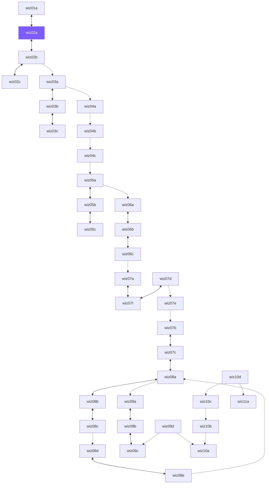

# The Open World — zone connection map

GENERATED by tools/owworld from the original maps' exit-trigger data.
Every edge is bidirectional in the openworld. Dashed edges were one-way
in the original campaign (the return gate is placed at the zone's player
start — marked `virtual`).

Dashed = original one-way transition, return gate is virtual (at the
destination's player start). Solid = real gates on both sides.

## Gates by zone

| Zone | Gate at | Leads to | Kind |
|---|---|---|---|
| ow_wiz01a | 1306, 1343 | ow_wiz02a (Galava) | original doorway |
| ow_wiz02a | 1364, 5327 | ow_wiz01a (the forest) | original doorway |
| ow_wiz02a | 3668, 3006 | ow_wiz02b (the Lost Library, first floor) | original doorway |
| ow_wiz02b | 3319, 4757 | ow_wiz02a (Galava) | original doorway |
| ow_wiz02b | 1136, 3225 | ow_wiz02c (the Lost Library, second floor) | original doorway |
| ow_wiz02b | 3250, 694 | ow_wiz02c (the Lost Library, second floor) | original doorway |
| ow_wiz02b | 4681, 5303 | ow_wiz03a (wiz03a) | original doorway |
| ow_wiz02c | 771, 5417 | ow_wiz02b (the Lost Library, first floor) | original doorway |
| ow_wiz02c | 1301, 329 | ow_wiz02b (the Lost Library, first floor) | original doorway |
| ow_wiz03a | 3224, 4447 | ow_wiz02b (the Lost Library, first floor) | virtual (player start) |
| ow_wiz03a | 2321, 4855 | ow_wiz03b (wiz03b) | original doorway |
| ow_wiz03a | 3462, 5278 | ow_wiz04a (wiz04a) | original doorway |
| ow_wiz03b | 5438, 3506 | ow_wiz03a (wiz03a) | original doorway |
| ow_wiz03b | 4652, 1492 | ow_wiz03c (wiz03c) | original doorway |
| ow_wiz03c | 1035, 4899 | ow_wiz03b (wiz03b) | original doorway |
| ow_wiz03c | 1462, 4678 | ow_wiz03b (wiz03b) | original doorway |
| ow_wiz04a | 4566, 1850 | ow_wiz03a (wiz03a) | virtual (player start) |
| ow_wiz04a | 1184, 943 | ow_wiz04b (wiz04b) | original doorway |
| ow_wiz04b | 5014, 5405 | ow_wiz04a (wiz04a) | virtual (player start) |
| ow_wiz04b | 602, 3156 | ow_wiz04c (wiz04c) | original doorway |
| ow_wiz04c | 4355, 5485 | ow_wiz04b (wiz04b) | virtual (player start) |
| ow_wiz04c | 667, 656 | ow_wiz05a (wiz05a) | original doorway |
| ow_wiz05a | 1523, 3480 | ow_wiz04c (wiz04c) | virtual (player start) |
| ow_wiz05a | 3093, 149 | ow_wiz05b (wiz05b) | original doorway |
| ow_wiz05a | 3957, 1050 | ow_wiz06a (wiz06a) | original doorway |
| ow_wiz05b | 241, 1529 | ow_wiz05a (wiz05a) | original doorway |
| ow_wiz05b | 1365, 5552 | ow_wiz05c (wiz05c) | original doorway |
| ow_wiz05b | 3542, 5382 | ow_wiz05c (wiz05c) | original doorway |
| ow_wiz05c | 4692, 644 | ow_wiz05b (wiz05b) | original doorway |
| ow_wiz06a | 4036, 4576 | ow_wiz05a (wiz05a) | virtual (player start) |
| ow_wiz06a | 3886, 3491 | ow_wiz06b (wiz06b) | original doorway |
| ow_wiz06b | 4213, 4373 | ow_wiz06a (wiz06a) | original doorway |
| ow_wiz06b | 3614, 3012 | ow_wiz06c (wiz06c) | original doorway |
| ow_wiz06c | 3095, 3208 | ow_wiz06b (wiz06b) | original doorway |
| ow_wiz06c | 657, 2726 | ow_wiz07a (wiz07a) | original doorway |
| ow_wiz07a | 2621, 4056 | ow_wiz06c (wiz06c) | virtual (player start) |
| ow_wiz07a | 2870, 3827 | ow_wiz07f (wiz07f) | original doorway |
| ow_wiz07b | 2131, 4931 | ow_wiz07c (wiz07c) | original doorway |
| ow_wiz07b | 457, 892 | ow_wiz07e (wiz07e) | virtual (player start) |
| ow_wiz07c | 4497, 4152 | ow_wiz07b (wiz07b) | original doorway |
| ow_wiz07c | 2266, 3370 | ow_wiz08a (wiz08a) | original doorway |
| ow_wiz07d | 3389, 4699 | ow_wiz07e (wiz07e) | virtual (player start) |
| ow_wiz07d | 3321, 4752 | ow_wiz07f (wiz07f) | original doorway |
| ow_wiz07e | 3161, 4613 | ow_wiz07b (wiz07b) | original doorway |
| ow_wiz07e | 2797, 1868 | ow_wiz07d (wiz07d) | virtual (player start) |
| ow_wiz07f | 1367, 5330 | ow_wiz07a (wiz07a) | original doorway |
| ow_wiz07f | 3668, 3006 | ow_wiz07d (wiz07d) | original doorway |
| ow_wiz08a | 632, 4542 | ow_wiz07c (wiz07c) | original doorway |
| ow_wiz08a | 3979, 1472 | ow_wiz08b (wiz08b) | original doorway |
| ow_wiz08a | 788, 4473 | ow_wiz08e (wiz08e) | virtual (player start) |
| ow_wiz08a | 425, 2128 | ow_wiz09a (the swamp (west)) | original doorway |
| ow_wiz08b | 3864, 4669 | ow_wiz08a (wiz08a) | original doorway |
| ow_wiz08b | 5486, 380 | ow_wiz08c (wiz08c) | original doorway |
| ow_wiz08c | 1867, 4318 | ow_wiz08b (wiz08b) | original doorway |
| ow_wiz08c | 5692, 310 | ow_wiz08d (wiz08d) | original doorway |
| ow_wiz08d | 4358, 5108 | ow_wiz08c (wiz08c) | virtual (player start) |
| ow_wiz08d | 5522, 4783 | ow_wiz08e (wiz08e) | original doorway |
| ow_wiz08e | 4330, 3439 | ow_wiz08a (wiz08a) | original doorway |
| ow_wiz08e | 1035, 3335 | ow_wiz08d (wiz08d) | original doorway |
| ow_wiz09a | 5505, 5613 | ow_wiz08a (wiz08a) | virtual (player start) |
| ow_wiz09a | 3601, 1433 | ow_wiz09b (the swamp (east)) | original doorway |
| ow_wiz09b | 1502, 3486 | ow_wiz09a (the swamp (west)) | original doorway |
| ow_wiz09b | 3925, 567 | ow_wiz09c (the tunnels) | original doorway |
| ow_wiz09c | 236, 4885 | ow_wiz09b (the swamp (east)) | original doorway |
| ow_wiz09c | 334, 4891 | ow_wiz09d (the wastelands) | virtual (player start) |
| ow_wiz09d | 2129, 5439 | ow_wiz09c (the tunnels) | original doorway |
| ow_wiz09d | 903, 1062 | ow_wiz10a (the Land of the Dead (I)) | original doorway |
| ow_wiz10a | 5573, 5500 | ow_wiz09d (the wastelands) | virtual (player start) |
| ow_wiz10a | 5483, 5500 | ow_wiz10b (the Land of the Dead (II)) | virtual (player start) |
| ow_wiz10b | 3151, 5278 | ow_wiz10a (the Land of the Dead (I)) | original doorway |
| ow_wiz10b | 3089, 5230 | ow_wiz10c (the Land of the Dead (III)) | virtual (player start) |
| ow_wiz10c | 1044, 2889 | ow_wiz10b (the Land of the Dead (II)) | original doorway |
| ow_wiz10c | 1103, 2830 | ow_wiz10d (the Land of the Dead (IV)) | virtual (player start) |
| ow_wiz10d | 2255, 5351 | ow_wiz10c (the Land of the Dead (III)) | original doorway |
| ow_wiz10d | 862, 770 | ow_wiz11a (Hecubah's lair) | original doorway |
| ow_wiz10d | 3786, 2356 | ow_wiz11a (Hecubah's lair) | original doorway |
| ow_wiz11a | 1217, 4897 | ow_wiz10d (the Land of the Dead (IV)) | virtual (player start) |

## Frontier (connections outside the current world)

- wiz08a -> con03a (outside world)

## Wizard start

New Open World wizards begin in **ow_wiz02a (Galava)** — the hub.
