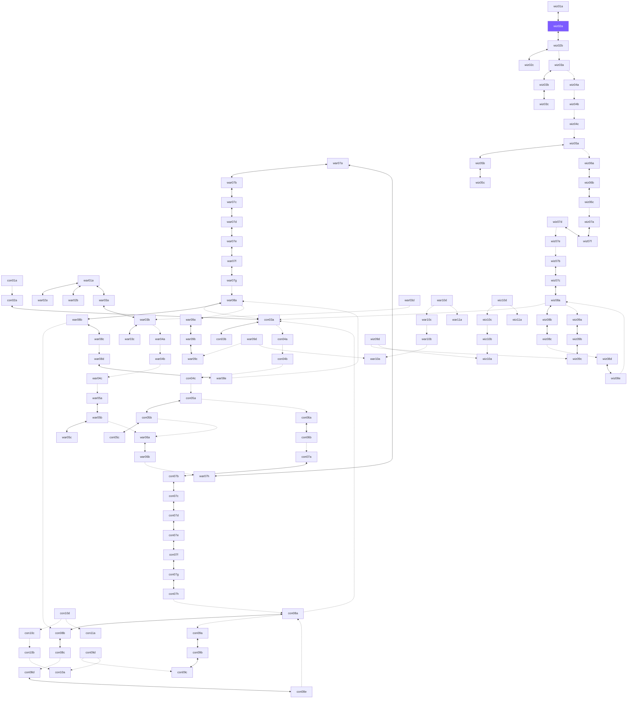

# The Open World — zone connection map

GENERATED by tools/owworld from the original maps' exit-trigger data.
Every edge is bidirectional in the openworld. Dashed edges were one-way
in the original campaign (the return gate is placed at the zone's player
start — marked `virtual`).

Dashed = original one-way transition, return gate is virtual (at the
destination's player start). Solid = real gates on both sides.

## Gates by zone

| Zone | Gate at | Leads to | Kind |
|---|---|---|---|
| ow_con01a | 4715, 2185 | ow_con02a (con02a) | original doorway |
| ow_con02a | 1070, 3450 | ow_con01a (con01a) | virtual (player start) |
| ow_con02a | 5440, 3876 | ow_con03a (con03a) | original doorway |
| ow_con03a | 345, 368 | ow_con02a (con02a) | original doorway |
| ow_con03a | 231, 4646 | ow_con03b (con03b) | original doorway |
| ow_con03a | 651, 3421 | ow_con04a (con04a) | original doorway |
| ow_con03a | 571, 414 | ow_con08a (con08a) | virtual (player start) |
| ow_con03a | 481, 414 | ow_war08a (war08a) | virtual (player start) |
| ow_con03a | 391, 414 | ow_wiz08a (wiz08a) | virtual (player start) |
| ow_con03b | 5428, 1748 | ow_con03a (con03a) | original doorway |
| ow_con04a | 4576, 1861 | ow_con03a (con03a) | virtual (player start) |
| ow_con04a | 1184, 943 | ow_con04b (con04b) | original doorway |
| ow_con04b | 5002, 5394 | ow_con04a (con04a) | virtual (player start) |
| ow_con04b | 602, 3156 | ow_con04c (con04c) | original doorway |
| ow_con04c | 4350, 5486 | ow_con04b (con04b) | virtual (player start) |
| ow_con04c | 667, 656 | ow_con05a (con05a) | original doorway |
| ow_con05a | 1522, 3481 | ow_con04c (con04c) | virtual (player start) |
| ow_con05a | 3097, 147 | ow_con05b (con05b) | original doorway |
| ow_con05a | 3406, 513 | ow_con06a (con06a) | original doorway |
| ow_con05b | 241, 1529 | ow_con05a (con05a) | original doorway |
| ow_con05b | 1355, 5545 | ow_con05c (con05c) | original doorway |
| ow_con05b | 2820, 4705 | ow_con05c (con05c) | original doorway |
| ow_con05b | 1298, 4556 | ow_war06a (war06a) | original doorway |
| ow_con05c | 4692, 644 | ow_con05b (con05b) | original doorway |
| ow_con06a | 5187, 2516 | ow_con05a (con05a) | virtual (player start) |
| ow_con06a | 3614, 3010 | ow_con06b (con06b) | original doorway |
| ow_con06b | 3094, 3208 | ow_con06a (con06a) | original doorway |
| ow_con06b | 5392, 2955 | ow_con07a (con07a) | original doorway |
| ow_con07a | 2621, 4056 | ow_con06b (con06b) | virtual (player start) |
| ow_con07a | 2870, 3827 | ow_con07b (con07b) | original doorway |
| ow_con07b | 1364, 5326 | ow_con07a (con07a) | original doorway |
| ow_con07b | 3668, 3006 | ow_con07c (con07c) | original doorway |
| ow_con07c | 832, 4753 | ow_con07b (con07b) | original doorway |
| ow_con07c | 2639, 4284 | ow_con07d (con07d) | original doorway |
| ow_con07d | 3334, 2150 | ow_con07c (con07c) | original doorway |
| ow_con07d | 2287, 586 | ow_con07e (con07e) | original doorway |
| ow_con07e | 3479, 2011 | ow_con07d (con07d) | original doorway |
| ow_con07e | 4808, 3034 | ow_con07f (con07f) | original doorway |
| ow_con07f | 4363, 5017 | ow_con07e (con07e) | original doorway |
| ow_con07f | 3648, 3888 | ow_con07g (con07g) | original doorway |
| ow_con07g | 2513, 3170 | ow_con07f (con07f) | original doorway |
| ow_con07g | 3417, 3827 | ow_con07h (con07h) | original doorway |
| ow_con07h | 2333, 1701 | ow_con07g (con07g) | original doorway |
| ow_con07h | 2149, 2150 | ow_con08a (con08a) | original doorway |
| ow_con08a | 5440, 3876 | ow_con03a (con03a) | original doorway |
| ow_con08a | 1108, 3627 | ow_con07h (con07h) | virtual (player start) |
| ow_con08a | 3979, 1472 | ow_con08b (con08b) | original doorway |
| ow_con08a | 1018, 3627 | ow_con08e (con08e) | virtual (player start) |
| ow_con08a | 632, 1920 | ow_con09a (con09a) | original doorway |
| ow_con08b | 3875, 4657 | ow_con08a (con08a) | original doorway |
| ow_con08b | 5486, 380 | ow_con08c (con08c) | original doorway |
| ow_con08b | 3781, 4584 | ow_war08b (war08b) | virtual (player start) |
| ow_con08c | 1867, 4318 | ow_con08b (con08b) | original doorway |
| ow_con08c | 5692, 310 | ow_con08d (con08d) | original doorway |
| ow_con08d | 4359, 5107 | ow_con08c (con08c) | virtual (player start) |
| ow_con08d | 5522, 4783 | ow_con08e (con08e) | original doorway |
| ow_con08e | 4330, 3439 | ow_con08a (con08a) | original doorway |
| ow_con08e | 1035, 3335 | ow_con08d (con08d) | original doorway |
| ow_con09a | 5505, 5613 | ow_con08a (con08a) | virtual (player start) |
| ow_con09a | 3601, 1433 | ow_con09b (con09b) | original doorway |
| ow_con09b | 1502, 3486 | ow_con09a (con09a) | original doorway |
| ow_con09b | 3925, 567 | ow_con09c (con09c) | original doorway |
| ow_con09c | 236, 4885 | ow_con09b (con09b) | original doorway |
| ow_con09c | 318, 4960 | ow_con09d (con09d) | virtual (player start) |
| ow_con09d | 2128, 5438 | ow_con09c (con09c) | original doorway |
| ow_con09d | 903, 1062 | ow_con10a (con10a) | original doorway |
| ow_con10a | 5488, 5511 | ow_con09d (con09d) | virtual (player start) |
| ow_con10a | 5578, 5511 | ow_con10b (con10b) | virtual (player start) |
| ow_con10b | 3151, 5290 | ow_con10a (con10a) | original doorway |
| ow_con10b | 3084, 5227 | ow_con10c (con10c) | virtual (player start) |
| ow_con10c | 1045, 2891 | ow_con10b (con10b) | original doorway |
| ow_con10c | 1119, 2816 | ow_con10d (con10d) | virtual (player start) |
| ow_con10d | 2255, 5351 | ow_con10c (con10c) | original doorway |
| ow_con10d | 861, 770 | ow_con11a (con11a) | original doorway |
| ow_con10d | 3760, 2300 | ow_con11a (con11a) | original doorway |
| ow_con11a | 1325, 3992 | ow_con10d (con10d) | virtual (player start) |
| ow_war01a | 2587, 5313 | ow_war02a (war02a) | original doorway |
| ow_war01a | 4531, 4143 | ow_war02b (war02b) | original doorway |
| ow_war01a | 4964, 2811 | ow_war03a (war03a) | original doorway |
| ow_war02a | 5324, 5302 | ow_war01a (war01a) | original doorway |
| ow_war02b | 494, 610 | ow_war01a (war01a) | original doorway |
| ow_war03a | 5704, 4232 | ow_war01a (war01a) | original doorway |
| ow_war03a | 344, 386 | ow_war03b (war03b) | original doorway |
| ow_war03b | 2446, 3696 | ow_war03a (war03a) | original doorway |
| ow_war03b | 4686, 2008 | ow_war03c (war03c) | original doorway |
| ow_war03b | 2392, 3657 | ow_war03d (war03d) | virtual (player start) |
| ow_war03b | 5160, 3741 | ow_war04a (war04a) | original doorway |
| ow_war03c | 1028, 4102 | ow_war03b (war03b) | original doorway |
| ow_war03d | 945, 4384 | ow_war03b (war03b) | original doorway |
| ow_war04a | 4564, 1850 | ow_war03b (war03b) | virtual (player start) |
| ow_war04a | 1184, 954 | ow_war04b (war04b) | original doorway |
| ow_war04b | 5002, 5394 | ow_war04a (war04a) | virtual (player start) |
| ow_war04b | 602, 3156 | ow_war04c (war04c) | original doorway |
| ow_war04c | 4369, 5492 | ow_war04b (war04b) | virtual (player start) |
| ow_war04c | 667, 656 | ow_war05a (war05a) | original doorway |
| ow_war05a | 1522, 3481 | ow_war04c (war04c) | virtual (player start) |
| ow_war05a | 3101, 149 | ow_war05b (war05b) | original doorway |
| ow_war05b | 241, 1530 | ow_war05a (war05a) | original doorway |
| ow_war05b | 1365, 5552 | ow_war05c (war05c) | original doorway |
| ow_war05b | 1923, 297 | ow_war05c (war05c) | original doorway |
| ow_war05b | 1298, 4556 | ow_war06a (war06a) | original doorway |
| ow_war05c | 4692, 644 | ow_war05b (war05b) | original doorway |
| ow_war06a | 5187, 2516 | ow_con05b (con05b) | virtual (player start) |
| ow_war06a | 5277, 2516 | ow_war05b (war05b) | virtual (player start) |
| ow_war06a | 3614, 3010 | ow_war06b (war06b) | original doorway |
| ow_war06b | 3113, 3205 | ow_war06a (war06a) | original doorway |
| ow_war06b | 5392, 2955 | ow_war07h (war07h) | original doorway |
| ow_war07a | 3690, 2983 | ow_war07b (war07b) | original doorway |
| ow_war07a | 1361, 5327 | ow_war07h (war07h) | original doorway |
| ow_war07b | 836, 4751 | ow_war07a (war07a) | original doorway |
| ow_war07b | 2642, 4287 | ow_war07c (war07c) | original doorway |
| ow_war07c | 3331, 2150 | ow_war07b (war07b) | original doorway |
| ow_war07c | 2311, 610 | ow_war07d (war07d) | original doorway |
| ow_war07d | 3499, 2033 | ow_war07c (war07c) | original doorway |
| ow_war07d | 4802, 3037 | ow_war07e (war07e) | original doorway |
| ow_war07e | 4477, 4897 | ow_war07d (war07d) | original doorway |
| ow_war07e | 3648, 3889 | ow_war07f (war07f) | original doorway |
| ow_war07f | 2514, 3169 | ow_war07e (war07e) | original doorway |
| ow_war07f | 3396, 3803 | ow_war07g (war07g) | original doorway |
| ow_war07g | 2405, 1758 | ow_war07f (war07f) | original doorway |
| ow_war07g | 1920, 2013 | ow_war08a (war08a) | original doorway |
| ow_war07h | 2621, 4056 | ow_war06b (war06b) | virtual (player start) |
| ow_war07h | 2870, 3827 | ow_war07a (war07a) | original doorway |
| ow_war08a | 5440, 3876 | ow_con03a (con03a) | original doorway |
| ow_war08a | 997, 3621 | ow_war07g (war07g) | virtual (player start) |
| ow_war08a | 3972, 1479 | ow_war08b (war08b) | original doorway |
| ow_war08a | 1087, 3621 | ow_war08e (war08e) | virtual (player start) |
| ow_war08a | 1991, 5023 | ow_war09a (war09a) | original doorway |
| ow_war08b | 5600, 264 | ow_con08b (con08b) | original doorway |
| ow_war08b | 3864, 4669 | ow_war08a (war08a) | original doorway |
| ow_war08b | 5486, 380 | ow_war08c (war08c) | original doorway |
| ow_war08c | 1867, 4318 | ow_war08b (war08b) | original doorway |
| ow_war08c | 5692, 310 | ow_war08d (war08d) | original doorway |
| ow_war08d | 4358, 5108 | ow_war08c (war08c) | virtual (player start) |
| ow_war08d | 5522, 4783 | ow_war08e (war08e) | original doorway |
| ow_war08e | 4330, 3439 | ow_war08a (war08a) | original doorway |
| ow_war08e | 1035, 3335 | ow_war08d (war08d) | original doorway |
| ow_war09a | 5505, 5613 | ow_war08a (war08a) | virtual (player start) |
| ow_war09a | 3601, 1433 | ow_war09b (war09b) | original doorway |
| ow_war09b | 1502, 3486 | ow_war09a (war09a) | original doorway |
| ow_war09b | 3925, 567 | ow_war09c (war09c) | original doorway |
| ow_war09c | 236, 4885 | ow_war09b (war09b) | original doorway |
| ow_war09c | 334, 4891 | ow_war09d (war09d) | virtual (player start) |
| ow_war09d | 2104, 5463 | ow_war09c (war09c) | original doorway |
| ow_war09d | 903, 1062 | ow_war10a (war10a) | original doorway |
| ow_war10a | 5486, 5499 | ow_war09d (war09d) | virtual (player start) |
| ow_war10a | 5576, 5499 | ow_war10b (war10b) | virtual (player start) |
| ow_war10b | 3153, 5284 | ow_war10a (war10a) | original doorway |
| ow_war10b | 3094, 5228 | ow_war10c (war10c) | virtual (player start) |
| ow_war10c | 1043, 2890 | ow_war10b (war10b) | original doorway |
| ow_war10c | 1127, 2818 | ow_war10d (war10d) | virtual (player start) |
| ow_war10d | 2255, 5351 | ow_war10c (war10c) | original doorway |
| ow_war10d | 862, 770 | ow_war11a (war11a) | original doorway |
| ow_war10d | 3784, 2358 | ow_war11a (war11a) | original doorway |
| ow_war11a | 2765, 2907 | ow_war10d (war10d) | virtual (player start) |
| ow_wiz01a | 1306, 1343 | ow_wiz02a (Galava) | original doorway |
| ow_wiz02a | 1364, 5327 | ow_wiz01a (the forest) | original doorway |
| ow_wiz02a | 3668, 3006 | ow_wiz02b (the Lost Library, first floor) | original doorway |
| ow_wiz02b | 3319, 4757 | ow_wiz02a (Galava) | original doorway |
| ow_wiz02b | 1136, 3225 | ow_wiz02c (the Lost Library, second floor) | original doorway |
| ow_wiz02b | 3250, 694 | ow_wiz02c (the Lost Library, second floor) | original doorway |
| ow_wiz02b | 4681, 5303 | ow_wiz03a (wiz03a) | original doorway |
| ow_wiz02c | 771, 5417 | ow_wiz02b (the Lost Library, first floor) | original doorway |
| ow_wiz02c | 1301, 329 | ow_wiz02b (the Lost Library, first floor) | original doorway |
| ow_wiz03a | 3224, 4447 | ow_wiz02b (the Lost Library, first floor) | virtual (player start) |
| ow_wiz03a | 2321, 4855 | ow_wiz03b (wiz03b) | original doorway |
| ow_wiz03a | 3462, 5278 | ow_wiz04a (wiz04a) | original doorway |
| ow_wiz03b | 5438, 3506 | ow_wiz03a (wiz03a) | original doorway |
| ow_wiz03b | 4652, 1492 | ow_wiz03c (wiz03c) | original doorway |
| ow_wiz03c | 1035, 4899 | ow_wiz03b (wiz03b) | original doorway |
| ow_wiz03c | 1462, 4678 | ow_wiz03b (wiz03b) | original doorway |
| ow_wiz04a | 4566, 1850 | ow_wiz03a (wiz03a) | virtual (player start) |
| ow_wiz04a | 1184, 943 | ow_wiz04b (wiz04b) | original doorway |
| ow_wiz04b | 5014, 5405 | ow_wiz04a (wiz04a) | virtual (player start) |
| ow_wiz04b | 602, 3156 | ow_wiz04c (wiz04c) | original doorway |
| ow_wiz04c | 4355, 5485 | ow_wiz04b (wiz04b) | virtual (player start) |
| ow_wiz04c | 667, 656 | ow_wiz05a (wiz05a) | original doorway |
| ow_wiz05a | 1523, 3480 | ow_wiz04c (wiz04c) | virtual (player start) |
| ow_wiz05a | 3093, 149 | ow_wiz05b (wiz05b) | original doorway |
| ow_wiz05a | 3957, 1050 | ow_wiz06a (wiz06a) | original doorway |
| ow_wiz05b | 241, 1529 | ow_wiz05a (wiz05a) | original doorway |
| ow_wiz05b | 1365, 5552 | ow_wiz05c (wiz05c) | original doorway |
| ow_wiz05b | 3542, 5382 | ow_wiz05c (wiz05c) | original doorway |
| ow_wiz05c | 4692, 644 | ow_wiz05b (wiz05b) | original doorway |
| ow_wiz06a | 4036, 4576 | ow_wiz05a (wiz05a) | virtual (player start) |
| ow_wiz06a | 3886, 3491 | ow_wiz06b (wiz06b) | original doorway |
| ow_wiz06b | 4213, 4373 | ow_wiz06a (wiz06a) | original doorway |
| ow_wiz06b | 3614, 3012 | ow_wiz06c (wiz06c) | original doorway |
| ow_wiz06c | 3095, 3208 | ow_wiz06b (wiz06b) | original doorway |
| ow_wiz06c | 657, 2726 | ow_wiz07a (wiz07a) | original doorway |
| ow_wiz07a | 2621, 4056 | ow_wiz06c (wiz06c) | virtual (player start) |
| ow_wiz07a | 2870, 3827 | ow_wiz07f (wiz07f) | original doorway |
| ow_wiz07b | 2131, 4931 | ow_wiz07c (wiz07c) | original doorway |
| ow_wiz07b | 457, 892 | ow_wiz07e (wiz07e) | virtual (player start) |
| ow_wiz07c | 4497, 4152 | ow_wiz07b (wiz07b) | original doorway |
| ow_wiz07c | 2266, 3370 | ow_wiz08a (wiz08a) | original doorway |
| ow_wiz07d | 3389, 4699 | ow_wiz07e (wiz07e) | virtual (player start) |
| ow_wiz07d | 3321, 4752 | ow_wiz07f (wiz07f) | original doorway |
| ow_wiz07e | 3161, 4613 | ow_wiz07b (wiz07b) | original doorway |
| ow_wiz07e | 2797, 1868 | ow_wiz07d (wiz07d) | virtual (player start) |
| ow_wiz07f | 1367, 5330 | ow_wiz07a (wiz07a) | original doorway |
| ow_wiz07f | 3668, 3006 | ow_wiz07d (wiz07d) | original doorway |
| ow_wiz08a | 5440, 3876 | ow_con03a (con03a) | original doorway |
| ow_wiz08a | 632, 4542 | ow_wiz07c (wiz07c) | original doorway |
| ow_wiz08a | 3979, 1472 | ow_wiz08b (wiz08b) | original doorway |
| ow_wiz08a | 788, 4473 | ow_wiz08e (wiz08e) | virtual (player start) |
| ow_wiz08a | 425, 2128 | ow_wiz09a (the swamp (west)) | original doorway |
| ow_wiz08b | 3864, 4669 | ow_wiz08a (wiz08a) | original doorway |
| ow_wiz08b | 5486, 380 | ow_wiz08c (wiz08c) | original doorway |
| ow_wiz08c | 1867, 4318 | ow_wiz08b (wiz08b) | original doorway |
| ow_wiz08c | 5692, 310 | ow_wiz08d (wiz08d) | original doorway |
| ow_wiz08d | 4358, 5108 | ow_wiz08c (wiz08c) | virtual (player start) |
| ow_wiz08d | 5522, 4783 | ow_wiz08e (wiz08e) | original doorway |
| ow_wiz08e | 4330, 3439 | ow_wiz08a (wiz08a) | original doorway |
| ow_wiz08e | 1035, 3335 | ow_wiz08d (wiz08d) | original doorway |
| ow_wiz09a | 5505, 5613 | ow_wiz08a (wiz08a) | virtual (player start) |
| ow_wiz09a | 3601, 1433 | ow_wiz09b (the swamp (east)) | original doorway |
| ow_wiz09b | 1502, 3486 | ow_wiz09a (the swamp (west)) | original doorway |
| ow_wiz09b | 3925, 567 | ow_wiz09c (the tunnels) | original doorway |
| ow_wiz09c | 236, 4885 | ow_wiz09b (the swamp (east)) | original doorway |
| ow_wiz09c | 334, 4891 | ow_wiz09d (the wastelands) | virtual (player start) |
| ow_wiz09d | 2129, 5439 | ow_wiz09c (the tunnels) | original doorway |
| ow_wiz09d | 903, 1062 | ow_wiz10a (the Land of the Dead (I)) | original doorway |
| ow_wiz10a | 5483, 5500 | ow_wiz09d (the wastelands) | virtual (player start) |
| ow_wiz10a | 5573, 5500 | ow_wiz10b (the Land of the Dead (II)) | virtual (player start) |
| ow_wiz10b | 3151, 5278 | ow_wiz10a (the Land of the Dead (I)) | original doorway |
| ow_wiz10b | 3089, 5230 | ow_wiz10c (the Land of the Dead (III)) | virtual (player start) |
| ow_wiz10c | 1044, 2889 | ow_wiz10b (the Land of the Dead (II)) | original doorway |
| ow_wiz10c | 1103, 2830 | ow_wiz10d (the Land of the Dead (IV)) | virtual (player start) |
| ow_wiz10d | 2255, 5351 | ow_wiz10c (the Land of the Dead (III)) | original doorway |
| ow_wiz10d | 862, 770 | ow_wiz11a (Hecubah's lair) | original doorway |
| ow_wiz10d | 3786, 2356 | ow_wiz11a (Hecubah's lair) | original doorway |
| ow_wiz11a | 1217, 4897 | ow_wiz10d (the Land of the Dead (IV)) | virtual (player start) |

## Frontier (connections outside the current world)

none

## Wizard start

New Open World wizards begin in **ow_wiz02a (Galava)** — the hub.
