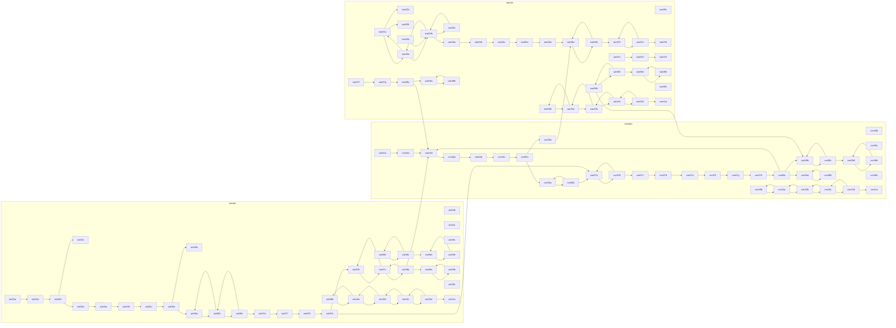

# World connectivity (script/object references)

Edges are cross-map references found in map scripts and object data —
transition candidates for the open-world rewiring.

```mermaid
graph LR
  subgraph warrior
    war01a
    war02a
    war02b
    war03a
    war03b
    war03c
    war03d
    war04a
    war04b
    war04c
    war05a
    war05b
    war05c
    war06a
    war06b
    war07a
    war07b
    war07c
    war07d
    war07e
    war07f
    war07g
    war07h
    war08a
    war08b
    war08c
    war08d
    war08e
    war09a
    war09b
    war09c
    war09d
    war10a
    war10b
    war10c
    war10d
    war11a
  end
  subgraph conjurer
    con01a
    con02a
    con03a
    con03b
    con04a
    con04b
    con04c
    con05a
    con05b
    con05c
    con06a
    con06b
    con07a
    con07b
    con07c
    con07d
    con07e
    con07f
    con07g
    con07h
    con08a
    con08b
    con08c
    con08d
    con08e
    con09a
    con09b
    con09c
    con09d
    con10a
    con10b
    con10c
    con10d
    con11a
  end
  subgraph wizard
    wiz01a
    wiz02a
    wiz02b
    wiz02c
    wiz03a
    wiz03b
    wiz03c
    wiz04a
    wiz04b
    wiz04c
    wiz05a
    wiz05b
    wiz05c
    wiz06a
    wiz06b
    wiz06c
    wiz07a
    wiz07b
    wiz07c
    wiz07d
    wiz07e
    wiz07f
    wiz08a
    wiz08b
    wiz08c
    wiz08d
    wiz08e
    wiz09a
    wiz09b
    wiz09c
    wiz09d
    wiz10a
    wiz10b
    wiz10c
    wiz10d
    wiz11a
  end
  con01a --> con02a
  con02a --> con03a
  con03a --> con04a
  con04a --> con04b
  con04b --> con04c
  con04c --> con05a
  con05a --> con05b
  con05a --> con06a
  con05b --> war06a
  con06a --> con06b
  con06b --> con06a
  con06b --> con07a
  con07a --> con07b
  con07b --> con07a
  con07b --> con07c
  con07c --> con07d
  con07d --> con07e
  con07e --> con07f
  con07f --> con07g
  con07g --> con07h
  con07h --> con08a
  con08a --> con03a
  con08a --> con08b
  con08a --> con09a
  con08b --> con08c
  con08c --> con08b
  con08c --> con08d
  con08d --> con08e
  con08e --> con08d
  con09a --> con09b
  con09b --> con09a
  con09d --> con10a
  con10a --> con09d
  con10a --> con10b
  con10b --> con10a
  con10b --> con10c
  con10c --> con10b
  con10c --> con10d
  con10d --> con10c
  con10d --> con11a
  war01a --> war02a
  war01a --> war02b
  war01a --> war03a
  war03a --> war01a
  war03a --> war03b
  war03b --> war03a
  war03b --> war03c
  war03b --> war04a
  war03c --> war03b
  war03d --> war03b
  war04a --> war04b
  war04b --> war04c
  war04c --> war05a
  war05a --> war05b
  war05b --> war06a
  war06a --> war06b
  war06b --> war06a
  war06b --> war07h
  war07a --> war07b
  war07a --> war07h
  war07c --> war07d
  war07d --> war07e
  war07f --> war07g
  war07g --> war08a
  war07h --> war07a
  war08a --> con03a
  war08a --> war09a
  war08b --> con08b
  war08b --> war08c
  war08c --> war08b
  war08c --> war08d
  war08d --> war08e
  war08e --> war08d
  war09a --> war09b
  war09b --> war09a
  war09d --> war10a
  war10a --> war09d
  war10a --> war10b
  war10b --> war10a
  war10b --> war10c
  war10c --> war10b
  war10c --> war10d
  war10d --> war10c
  war10d --> war11a
  wiz01a --> wiz02a
  wiz02a --> wiz02b
  wiz02b --> wiz02c
  wiz02b --> wiz03a
  wiz03a --> wiz04a
  wiz04a --> wiz04b
  wiz04b --> wiz04c
  wiz04c --> wiz05a
  wiz05a --> wiz05b
  wiz05a --> wiz06a
  wiz06a --> wiz06b
  wiz06b --> wiz06a
  wiz06b --> wiz06c
  wiz06c --> wiz06b
  wiz06c --> wiz07a
  wiz07a --> wiz07f
  wiz07b --> wiz07c
  wiz07c --> wiz07b
  wiz07c --> wiz08a
  wiz07d --> wiz07e
  wiz07e --> con07a
  wiz07e --> wiz07b
  wiz07f --> wiz07d
  wiz08a --> con03a
  wiz08a --> wiz07c
  wiz08a --> wiz09a
  wiz08b --> wiz08c
  wiz08c --> wiz08b
  wiz08c --> wiz08d
  wiz08d --> wiz08e
  wiz08e --> wiz08d
  wiz09a --> wiz09b
  wiz09b --> wiz09a
  wiz09d --> wiz10a
  wiz10a --> wiz09d
  wiz10a --> wiz10b
  wiz10b --> wiz10a
  wiz10b --> wiz10c
  wiz10c --> wiz10b
  wiz10c --> wiz10d
  wiz10d --> wiz10c
  wiz10d --> wiz11a
```
